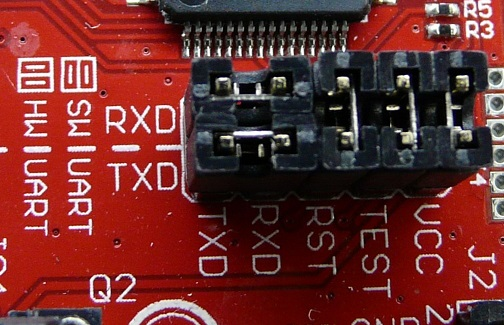

# Assignment One: Encoder / Decoder

For this assignment, you will write a function with the following prototype:

```c
char* code(char*);
```

Provided for you is a `main.c` file that will do the work of obtaining user input. **Do not modify this file**. You will write your implementation of this function in the `code.c` file.

### How It Works

    > hello
    104 101 108 108 111
    > 104 101 108 108 111
    hello
    > secret message
    115 101 99 114 101 116 32 109 101 115 115 97 103 101
    > 115 101 99 114 101 116 32 109 101 115 115 97 103 101
    secret message
    >

The function should first test to see whether the input given is text (characters `a-z` and `A-Z`) or a list of numbers (characters `0-9`). Then, if it is text, it should output the decimal value of each character **separated by spaces**. If it is a list of numbers, it should output the ascii characters represented by the values.

### Restrictions

1. You may **not** use any libc functions such as `atoi()` or `printf()`, basically no calling any functions that you did not write yourself
1. You may **not** declare any more global variables beyond the provided `char buf[128]`

### Using Screen or Minicom

To actually interact with the program running on the MSP430, you must use a tool on your machine that can listen directly to the USB port such as `minicom`. The installation script should have installed and configured this program for you. If you are using a newer board, then you will want to be sure you are listening on device `/dev/ttyACM1`. For the older boards, you will need to listen to device `/dev/ttyACM0`.

### Rotating Jumpers

For the communication between your machine and the launchpad to work correct **you need to rotate two jumpers 90 degrees**. Please see the picture below. This is the `HW UART` configuration etched into the circuit board to the left. Ensure this is how they are arranged on your board.



